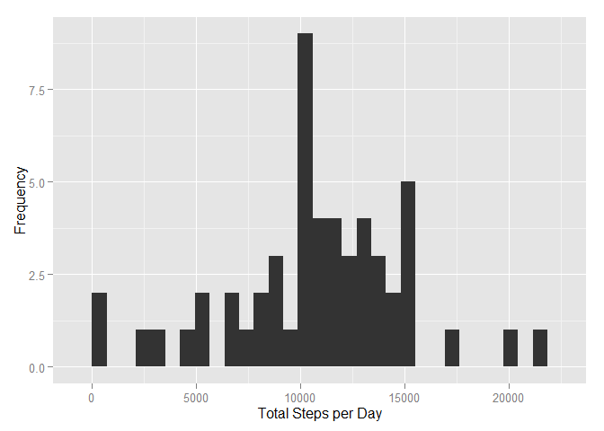
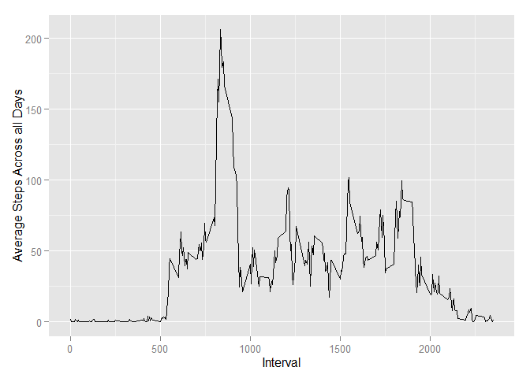
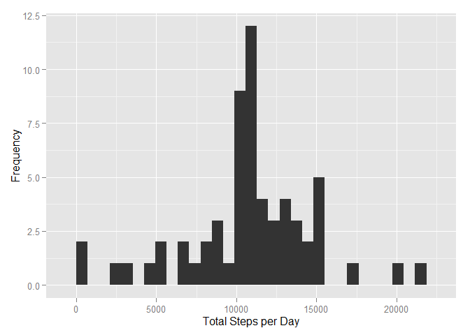
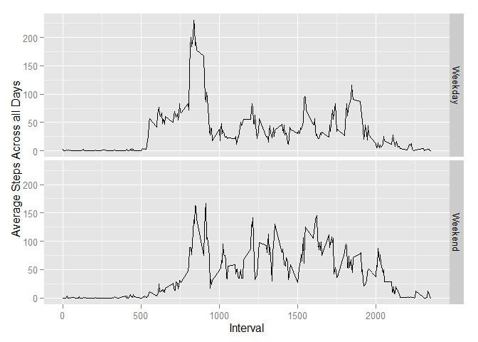

# Reproducible Research: Peer Assessment 1


## Loading and preprocessing the data

We shall require **dplyr** and **ggplot2** libraries:

```r
library(dplyr)
library(ggplot2)
```

The following codes will load the data and convert the date column to Date type. Subsequently, a dplyr table data frame is created and we shall work from there:


```r
# load data
activity <- read.csv("activity.csv")

# convert the date column to date type
activity$date <- as.Date(activity$date)

# create a dplyr data frame to work with
actvt <- tbl_df(activity)
```

## What is mean total number of steps taken per day?

This code will aggregate the number of steps by day:


```r
daily_steps <- actvt %>% group_by(date) %>% summarise(total = sum(steps))
```

This chart represents the histogram (not a bar plot!) of the total number of steps taken each day:


```r
g <- ggplot(daily_steps, aes(total))
g + geom_histogram() + labs(x = "Total Steps per Day", y = "Frequency")
```

 

The mean of the steps per day is:


```
## [1] 10766.19
```

And the median for number of steps is:


```
## [1] 10765
```


## What is the average daily activity pattern?

This code will produce the aggregated average steps per interval across all days:


```r
interval_steps <- actvt %>% group_by(interval) %>% summarise(avg = mean(steps, na.rm = TRUE))

interval_steps
```

```
## Source: local data frame [288 x 2]
## 
##    interval       avg
## 1         0 1.7169811
## 2         5 0.3396226
## 3        10 0.1320755
## 4        15 0.1509434
## 5        20 0.0754717
## 6        25 2.0943396
## 7        30 0.5283019
## 8        35 0.8679245
## 9        40 0.0000000
## 10       45 1.4716981
## ..      ...       ...
```

This will make a time series plot (i.e. type = "l") of the 5-minute interval (x-axis) and the average number of steps taken, averaged across all days (y-axis):


```r
g <- ggplot(interval_steps, aes(interval, avg))
g + geom_line() + labs(x = "Interval", y = "Average Steps Across all Days")
```

 

From the graph we could see that the highest average is around the 750-900 minutes interval (to be exact at 835th interval)

## Imputing missing values

The following calculates the number of missing values in the dataset:


```r
sum(is.na(activity$steps))
```

```
## [1] 2304
```

For the purpose of filling up the NA's, we shall use the average of that minutes interval. This shall create a new dataset with NAs being filled:


```r
new_actvt <- actvt %>% group_by(interval) %>% mutate(steps = ifelse(is.na(steps), mean(steps, na.rm = TRUE), steps))
```

This chart represents a new histogram of the total number of steps taken each day using the new data:


```r
new_daily_steps <- new_actvt %>% group_by(date) %>% summarise(total = sum(steps))
g <- ggplot(new_daily_steps, aes(total))
g + geom_histogram() + labs(x = "Total Steps per Day", y = "Frequency")
```

 

The mean of the steps per day is:


```
## [1] 10766.19
```

And the median for number of steps is:


```
## [1] 10766.19
```

From the new mean and median, we could see that the impact is minimal and only on the median value.

## Are there differences in activity patterns between weekdays and weekends?

Adding a new column to indicate whether weekend or weekday:


```r
new_actvt <- new_actvt %>% mutate(weekdaytype = ifelse(weekdays(date) %in% c("Saturday", "Sunday"), "Weekend", "Weekday"))
```

Plotting a panel plot containing a time series plot (i.e. type = "l") of the 5-minute interval (x-axis) and the average number of steps taken, averaged across all weekday days or weekend days (y-axis):


```r
new_interval_steps <- new_actvt %>% group_by(interval, weekdaytype) %>% summarise(avg = mean(steps, na.rm = TRUE))
g <- ggplot(new_interval_steps, aes(interval, avg))
g + geom_line() + labs(x = "Interval", y = "Average Steps Across all Days") + facet_grid(weekdaytype ~.)
```

 

From the graph it seems that activities do not differ much between weekdays and weekends.
